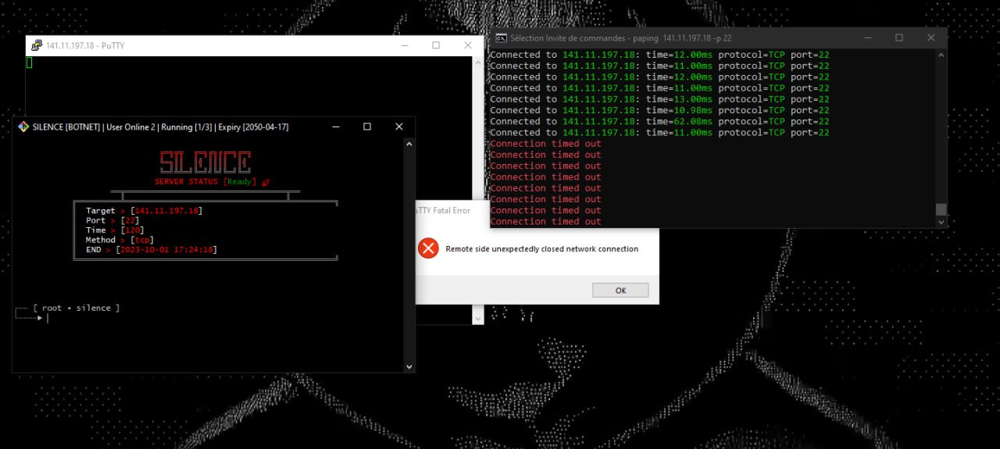

# Silence Botnet

The Silence Botnet application is a powerful tool designed to perform Distributed Denial of Service (DDoS) attacks. It uses a network of infected machines to simultaneously send a large number of requests to a specific target, resulting in an overload of the target server and making it unavailable for legitimate users.

## How it works

1. **Machine infection**: Silence Botnet spreads by infecting vulnerable computers using security vulnerability exploitation techniques or phishing.

2. **Centralized control**: Once a machine is infected, it connects to a centralized Command and Control (C&C) server. This server is used by attackers to send instructions to the infected machines.

3. **Attack coordination**: The C&C server sends commands to the infected machines to launch DDoS attacks against a specific target. The infected machines simultaneously send a large number of requests to the target, resulting in an overload of the target server.

4. **Anonymity**: Silence Botnet often uses anonymization techniques such as routing through proxy networks or using Virtual Private Networks (VPNs) to mask the origin of the attacks.

## Prevention measures

It is essential to take measures to protect against botnet attacks. Here are some recommendations:

- Keep your operating system and software up to date with the latest security patches.
- Use antivirus software and a firewall to detect and block botnet infections.
- Avoid clicking on suspicious links or downloading files from untrusted sources.
- Use strong passwords and change them regularly.
- Monitor network traffic and look for signs of botnet activity.

> Note: The use of Silence Botnet for malicious purposes is illegal. This document is provided for educational purposes only to understand the functioning of botnets and associated prevention measures.

